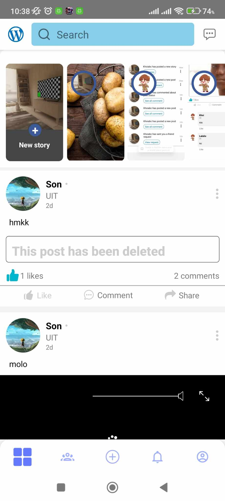

<br/>
<p align="center">
  <h3 align="center">Cloud Media</h3>

</p>

## Table Of Contents

- [About the Project](#about-the-project)
- [Getting Started](#getting-started)
  - [Prerequisites](#prerequisites)
  - [Installation](#installation)
- [Usage](#usage)
- [Authors](#authors)
- [Acknowledgements](#acknowledgements)

## About The Project

<!--  -->


## Getting Started

### Prerequisites

This is an example of how to list things you need to use the software and how to install them.

- Go to frontend folder

```sh
cd frontend
```

- npm

```sh
npm i
```

- npm start

```sh
npm start
```

- And then press a

```sh
a
```

### Installation

Clone the repo

```sh
git clone https://github.com/ThNam203/WorkWise
```

## Usage

Start using the app for study, searching and social media purposes!

## Authors

- **Huỳnh Thành Nam** - _Student_ - [Huỳnh Thành Nam](https://github.com/ThNam203) - _21522356_
- **Trương Văn Hoàng Sơn** - _Student_ - [Trương Văn Hoàng Sơn](https://github.com/tvhson) - _21520101_
- **Nguyễn Nguyên Khôi** - _Student_ - [Nguyễn Nguyên Khôi](https://github.com/Khooiiiii) - _21521010_

## Acknowledgements

- [Huỳnh Thành Nam](https://github.com/ThNam203)
- [Trương Văn Hoàng Sơn](https://github.com/tvhson)
- [Nguyễn Nguyên Khôi](https://github.com/Khooiiiii)
